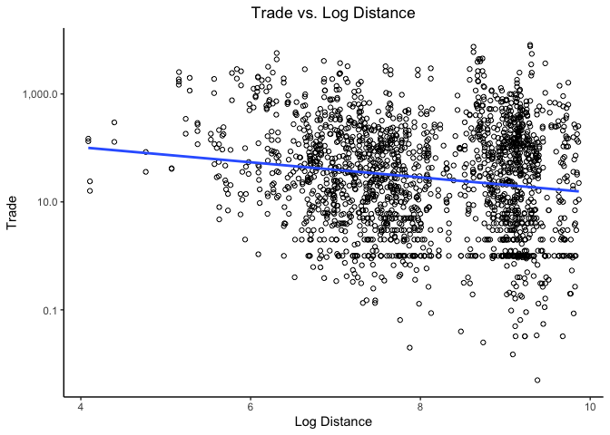
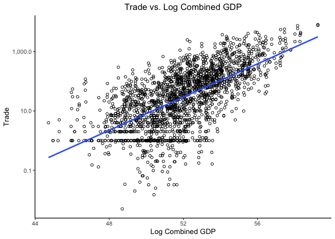
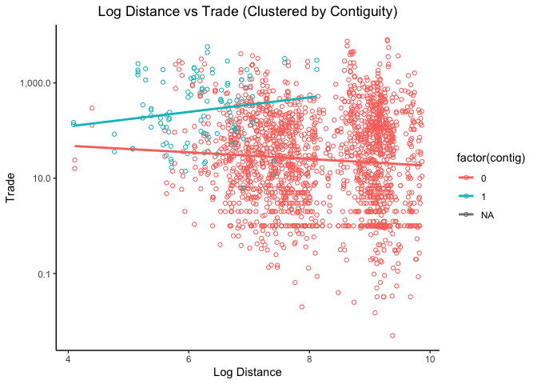
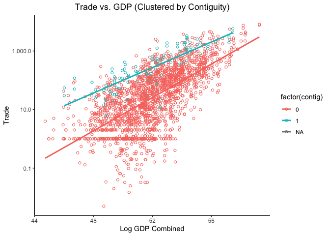
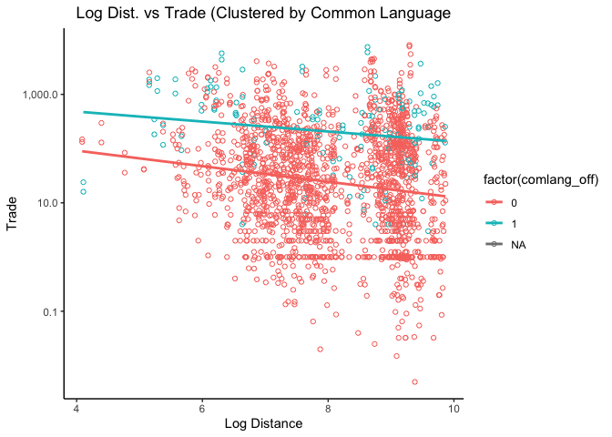
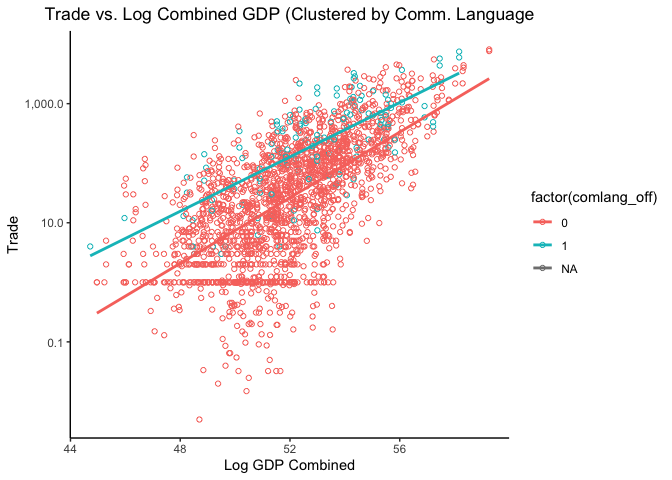

The Gravity Model
================
Jesus Davila- Sara Savino- Adoracion Hernandez
25/10/2021

-   [Background and Setup](#background-and-setup)
    -   [Setup](#setup)
    -   [Data Cleaning and Correlation](#data-cleaning-and-correlation)
-   [QUESTION 1](#question-1)
    -   [Summary Statistics](#summary-statistics)
    -   [Describe the Dimensions of the
        Data](#describe-the-dimensions-of-the-data)
-   [QUESTION 2](#question-2)
    -   [2.1. Trade and Log Distance](#21-trade-and-log-distance)
    -   [2.2 Trade and Combined GDP](#22-trade-and-combined-gdp)
    -   [2.3. a. Trade and Distance Clustered by
        Contiguity](#23-a-trade-and-distance-clustered-by-contiguity)
    -   [2.3.b. Trade and Combined GDP Clustered by
        Contiguity](#23b-trade-and-combined-gdp-clustered-by-contiguity)
    -   [2.4.a. Trade and Log Distance Clustered by Common
        Language](#24a-trade-and-log-distance-clustered-by-common-language)
    -   [2.4.b. Trade and Log Combined GDP Clustered by Common
        Language](#24b-trade-and-log-combined-gdp-clustered-by-common-language)
-   [QUESTION 3](#question-3)
    -   [3.1. Discuss the overall quality of your model (i.e. goodness
        of fit and results from
        F-test)](#31-discuss-the-overall-quality-of-your-model-ie-goodness-of-fit-and-results-from-f-test)
    -   [3.2. Describe the effect of distance on
        trade.](#32-describe-the-effect-of-distance-on-trade)
    -   [3.3. Discuss how relevant it is for trade
        partners:](#33-discuss-how-relevant-it-is-for-trade-partners)
        -   [3.3.1. To have a common
            border](#331-to-have-a-common-border)
        -   [3.3.2. to speak the same
            language.](#332-to-speak-the-same-language)
        -   [3.3.3. to have been in some sort of colonial relationship
            with the same colonizing
            nation?](#333-to-have-been-in-some-sort-of-colonial-relationship-with-the-same-colonizing-nation)
    -   [3.4. Describe the effect of GDP on trade, for both importers’
        and exporters’
        GDP.](#34-describe-the-effect-of-gdp-on-trade-for-both-importers-and-exporters-gdp)
    -   [3.5. Test (and discuss) the joint hypothesis that none of the
        parameters associated with the dichotomous variables impact
        trade.](#35-test-and-discuss-the-joint-hypothesis-that-none-of-the-parameters-associated-with-the-dichotomous-variables-impact-trade)
-   [QUESTION 4](#question-4)
    -   [4.1. Discuss the overall quality of your model (i.e. goodness
        of fit and results from
        F-test)](#41-discuss-the-overall-quality-of-your-model-ie-goodness-of-fit-and-results-from-f-test)
    -   [4.2. Describe the effect of distance on
        trade.](#42-describe-the-effect-of-distance-on-trade)
    -   [4.3 Explain intuitively why variables measuring GDP should not
        be included in the econometric model when importer and exporter
        fixed effects are included. What other types of variables can
        the importer and exporter fixed effects
        capture?](#43-explain-intuitively-why-variables-measuring-gdp-should-not-be-included-in-the-econometric-model-when-importer-and-exporter-fixed-effects-are-included-what-other-types-of-variables-can-the-importer-and-exporter-fixed-effects-capture)
-   [QUESTION 5](#question-5)
    -   [5.1. Discuss the overall quality of your model (i.e. goodness
        of fit and results from
        F-test)](#51-discuss-the-overall-quality-of-your-model-ie-goodness-of-fit-and-results-from-f-test)
    -   [5.2. Describe the effect of distance on
        trade.](#52-describe-the-effect-of-distance-on-trade)
    -   [5.3. What is the effect on trade of being an OECD
        member?](#53-what-is-the-effect-on-trade-of-being-an-oecd-member)
-   [Summary of Results](#summary-of-results)

# Background and Setup

In this assignment, we will be working with the data set and regressions
used in Shepherd, Doytchinova and Kravchenko’s 2019 User Guide for using
R to estimate the Gravity Model of International Trade.

## Setup

``` r
#Import the data and select the TSP sector 
knitr::opts_chunk$set(echo = TRUE)
bilateralData <- read.dta("servicesdataset 2.dta")
TSPdata <- bilateralData[bilateralData$sector=="TSP",]
```

## Data Cleaning and Correlation

``` r
#Prepare data for correlation-4 variables only 
TSPdataGRM <- TSPdata[,c("trade","dist","gdp_exp","gdp_imp")]
#filter out all rows containing 0 
row_sub = apply(TSPdataGRM, 1, function(row) all(row !=0 ))
TSPdataGRM <- TSPdataGRM[row_sub,]

#prepare correlation and remove all NA or zero values 
correlation <- cor(log(TSPdataGRM), use="na.or.complete")
print(correlation)
```

    ##              trade       dist     gdp_exp     gdp_imp
    ## trade    1.0000000 -0.1528602  0.47432477  0.42394558
    ## dist    -0.1528602  1.0000000  0.21440184  0.24099757
    ## gdp_exp  0.4743248  0.2144018  1.00000000 -0.03864912
    ## gdp_imp  0.4239456  0.2409976 -0.03864912  1.00000000

# QUESTION 1

## Summary Statistics

We first cleaned and prepared the dataset by selecting the Transport
Services sector and selecting the variables we are interested in. These
includes trade (volume), distance (the geographical space between
countries in miles), GDP of export country, GDP of import country,
contig (common land border), comlang_off (common official language),
colony (denotes if the countries were ever in a colonial relationship)
and comcol (denotes that the countries were colonized by the same
power).

After cleaning the data to remove all instances in which the amount of
trade is zero, we generated the descriptive statistics for the data.

``` r
#Prepare data for descriptive statistics for following variables: trade,  distance,  GDP  of  importer  and  exporter, contiguity,  common  language,  common  colonizer  and  colony

TSPdataDS <- TSPdata[,c("trade","dist","gdp_exp","gdp_imp", "contig", "comlang_off", "colony", "comcol")]

# Filter all rows where trade = 0 
TSPdataDS <- filter_at(TSPdataDS, vars("trade"), all_vars((.) != 0))

#Generate summary statistics table
sumtable(TSPdataDS)
```

<table class="table" style="margin-left: auto; margin-right: auto;">
<caption>
Summary Statistics
</caption>
<thead>
<tr>
<th style="text-align:left;">
Variable
</th>
<th style="text-align:left;">
N
</th>
<th style="text-align:left;">
Mean
</th>
<th style="text-align:left;">
Std. Dev.
</th>
<th style="text-align:left;">
Min
</th>
<th style="text-align:left;">
Pctl. 25
</th>
<th style="text-align:left;">
Pctl. 75
</th>
<th style="text-align:left;">
Max
</th>
</tr>
</thead>
<tbody>
<tr>
<td style="text-align:left;">
trade
</td>
<td style="text-align:left;">
2029
</td>
<td style="text-align:left;">
220.004
</td>
<td style="text-align:left;">
619.4
</td>
<td style="text-align:left;">
0.005
</td>
<td style="text-align:left;">
4.974
</td>
<td style="text-align:left;">
149
</td>
<td style="text-align:left;">
8145
</td>
</tr>
<tr>
<td style="text-align:left;">
dist
</td>
<td style="text-align:left;">
1998
</td>
<td style="text-align:left;">
5279.794
</td>
<td style="text-align:left;">
4552.941
</td>
<td style="text-align:left;">
59.617
</td>
<td style="text-align:left;">
1373.27
</td>
<td style="text-align:left;">
8944.426
</td>
<td style="text-align:left;">
19263.883
</td>
</tr>
<tr>
<td style="text-align:left;">
gdp_exp
</td>
<td style="text-align:left;">
2002
</td>
<td style="text-align:left;">
760413682873.598
</td>
<td style="text-align:left;">
1845414888751.71
</td>
<td style="text-align:left;">
127444000
</td>
<td style="text-align:left;">
61656830457
</td>
<td style="text-align:left;">
6.36769e+11
</td>
<td style="text-align:left;">
1.09367e+13
</td>
</tr>
<tr>
<td style="text-align:left;">
gdp_imp
</td>
<td style="text-align:left;">
1998
</td>
<td style="text-align:left;">
764160824469.216
</td>
<td style="text-align:left;">
1844089366315.19
</td>
<td style="text-align:left;">
1898582498
</td>
<td style="text-align:left;">
61902502732
</td>
<td style="text-align:left;">
6.36769e+11
</td>
<td style="text-align:left;">
1.09367e+13
</td>
</tr>
<tr>
<td style="text-align:left;">
contig
</td>
<td style="text-align:left;">
1998
</td>
<td style="text-align:left;">
0.053
</td>
<td style="text-align:left;">
0.224
</td>
<td style="text-align:left;">
0
</td>
<td style="text-align:left;">
0
</td>
<td style="text-align:left;">
0
</td>
<td style="text-align:left;">
1
</td>
</tr>
<tr>
<td style="text-align:left;">
comlang_off
</td>
<td style="text-align:left;">
1998
</td>
<td style="text-align:left;">
0.07
</td>
<td style="text-align:left;">
0.255
</td>
<td style="text-align:left;">
0
</td>
<td style="text-align:left;">
0
</td>
<td style="text-align:left;">
0
</td>
<td style="text-align:left;">
1
</td>
</tr>
<tr>
<td style="text-align:left;">
colony
</td>
<td style="text-align:left;">
1998
</td>
<td style="text-align:left;">
0.042
</td>
<td style="text-align:left;">
0.201
</td>
<td style="text-align:left;">
0
</td>
<td style="text-align:left;">
0
</td>
<td style="text-align:left;">
0
</td>
<td style="text-align:left;">
1
</td>
</tr>
<tr>
<td style="text-align:left;">
comcol
</td>
<td style="text-align:left;">
1998
</td>
<td style="text-align:left;">
0.021
</td>
<td style="text-align:left;">
0.143
</td>
<td style="text-align:left;">
0
</td>
<td style="text-align:left;">
0
</td>
<td style="text-align:left;">
0
</td>
<td style="text-align:left;">
1
</td>
</tr>
</tbody>
</table>

``` r
dim(TSPdataDS)
```

    ## [1] 2029    8

## Describe the Dimensions of the Data

The dataset provides information for 2029 trade combinations (country
pairs) across these 8 variables. Each of these combinations represent
the trade relationship between a pair of countries, with a country being
either the exporter or importer. Distance, GDP Importer, contig,
comlang_off, colony and comcol contain 31 missing observations, while
GDP Export contain 27 missing observations.

In terms of trade, the average trade between pairs of countries was 220
credits with a minimum of 0 and a maximum of 8145. The average distance
between countries who trade is 5,279 kms, measured by the distance
between the most populated cities in each country, with a minimum of 59
and a maximum of 19,263. The mean GDP of importers and exporters is
similar as the same pairs of countries are analyzed, although we observe
a high standard deviation as we have considerable variation in the data:
the data includes very small countries and very large countries. From
the data we can see that most countries do not share a border, common
language or common colonizer as demonstrated by the very low average for
each dummy variable.

# QUESTION 2

## 2.1. Trade and Log Distance

``` r
df = read.dta("servicesdataset 2.dta", convert.f=TRUE)
logdistance <- log(TSPdataGRM$dist) #Rows containing zero already filtered out
logtrade <- log(TSPdataGRM$trade) #Rows containing zero already filtered out 
plot1 <- ggplot(TSPdataDS, aes(x = logdistance, y = trade,)) +
 geom_point(shape=1) + 
 geom_smooth(method=lm, # Add linear regression line
 se=FALSE) + # Don't add shaded confidence region
 theme_classic() + #no background
 ggtitle("Trade vs. Log Distance") +
 theme(plot.title = element_text(hjust = 0.5)) + # put title in the middle
 labs(y="Trade", x = "Log Distance") + # set names for axes
 scale_y_log10(labels = scales::comma)# ln base scale
plot1
```

    ## `geom_smooth()` using formula 'y ~ x'

<!-- -->

We produce a scatterplot to examine the strength and direction of the
relationship between distance and trade. We take the natural log of the
distance variable, and keep trade linear. The resulting scatterplot
shows us that trade and distance are moderately negatively correlated.
This finding supports the intuition that countries which are further
apart, and for which transport and logistical costs increase, trade
less. Our results are aligned with the traditional definition of the
gravity model as described by Tinbergen in 1962 or Anderson in 1979.

## 2.2 Trade and Combined GDP

``` r
logdifference <- log(TSPdataGRM$gdp_exp * TSPdataGRM$gdp_imp)
plot2 <- ggplot(TSPdataDS, aes(x = logdifference, y = trade,)) +
 geom_point(shape=1) + 
 geom_smooth(method=lm, # Add linear regression line
 se=FALSE) + # Don't add shaded confidence region
 theme_classic() + #No background
 ggtitle("Trade vs. Log Combined GDP") +
 theme(plot.title = element_text(hjust = 0.5)) + # put title in the middle
 labs(y="Trade", x = "Log Combined GDP") + # set names for axes
 scale_y_log10(labels = scales::comma)# ln base scale
plot2
```

    ## `geom_smooth()` using formula 'y ~ x'

<!-- -->

We create a scatter plot which takes the log of the combined export and
import country GDP, and plot it against trade. The scatterplot shows a
positive relationship between trade and combined GDP, confirming the
basic intuition that bigger countries tend to trade more among
themselves in line with the predictions of the Gravity model.

## 2.3. a. Trade and Distance Clustered by Contiguity

``` r
plot3 <- ggplot(TSPdataDS, aes(x=logdistance,
                         y=trade, colour=factor(contig))) +
                        geom_point(shape=1) + 
                        geom_smooth(method=lm, # Add linear regression line
                                se=FALSE,   # Don't add shaded confidence region
                                ) + 
                        theme_classic() + #no background
                        ggtitle("Log Distance vs Trade (Clustered by Contiguity)") +
                        theme(plot.title = element_text(hjust = 0.5)) + # put title in the middle
                        labs(y="Trade", x = "Log Distance") + # set names for axes
                        scale_y_log10(labels = scales::comma)# ln base scale
plot3
```

    ## `geom_smooth()` using formula 'y ~ x'

<!-- -->

We repeat the same scatter plot as in 3.1, but cluster it by contiguity
this time. The scatter plot indicates that for countries that share a
land border, there is a positive relationship between distance and
trade, while this relationship becomes negative for countries that do
not share a land border.

It seems that when countries share a land border, distance becomes a
less important barrier to trade, and the volume of trade increases as
the distance increases. It could reflect that countries that share a
border may lift trade restrictions, which facilitate trade flows despite
the increased costs associated with travel. This collinearity between
distance and multilateral resistance is one of the reasons that we
introduce fixed effects later on in this assignment. For countries that
do not share a land border, distance becomes much more important, with
trade volumes declining as distance increases, in line with the
prediction of the Gravity model.

## 2.3.b. Trade and Combined GDP Clustered by Contiguity

``` r
plot4 <- ggplot(TSPdataDS, aes(x=logdifference,
                         y=trade, colour=factor(contig))) +
                        geom_point(shape=1) + # Use hollow circles
                        geom_smooth(method=lm, # Add linear regression line
                                se=FALSE,   # Don't add shaded confidence region
                                ) + 
                        theme_classic() + #no background
                        ggtitle("Trade vs. GDP (Clustered by Contiguity)") +
                        theme(plot.title = element_text(hjust = 0.5)) + # put title in the middle
                        labs(y="Trade", x = "Log GDP Combined") + # set names for axes
                        scale_y_log10(labels = scales::comma)# ln base scale
plot4
```

    ## `geom_smooth()` using formula 'y ~ x'

<!-- -->

We repeat the scatter plot plotting the log of combined GDP against
trade, but cluster it by contiguity this time. We find that the positive
relationship between GDP and trade holds up whether countries share a
land border or not.

Overall, graphical evidence seems to support that countries with a
larger GDP will engage in more trade. Distance becomes a factor
negatively affecting trade between countries across the board, except
for countries which share a land border. For countries that share a land
border, it seems that distance not only becomes less important, but that
trade actually increases as distance increases. For countries that do
not share a land border, we see a stronger positive relationship between
GDP and trade than for countries that do share a land border. This
intuitively makes sense when we consider that many countries with a
larger GDP that may engage in trade with each other do not share a land
border (e.g. the USA and China). Additionally, distance measures the
distance between the most populated cities in each country. In many
cases, these cities might be far from the border between the countries
(e.g. Washington D.C. and Mexico City).

## 2.4.a. Trade and Log Distance Clustered by Common Language

``` r
plot5 <- ggplot(TSPdataDS, aes(x=logdistance,
                         y=trade, colour=factor(comlang_off))) +
                        geom_point(shape=1) + # Use hollow circles
                        geom_smooth(method=lm, # Add linear regression line
                                se=FALSE,   # Don't add shaded confidence region
                                ) + 
                        theme_classic() + #no background
                        ggtitle("Log Dist. vs Trade (Clustered by Common Language") +
                        theme(plot.title = element_text(hjust = 0.5)) + # put title in the middle
                        labs(y="Trade", x = "Log Distance") + # set names for axes
                        scale_y_log10(labels = scales::comma)# ln base scale
plot5
```

    ## `geom_smooth()` using formula 'y ~ x'

<!-- -->

We run the same scatter plot as in 2.1., this time clustering by common
language. We find that the negative relationship between distance and
trade remains true whether countries share an official language or not,
and that the strength of the relationship is almost equivalent in both
cases.

## 2.4.b. Trade and Log Combined GDP Clustered by Common Language

``` r
plot6 <- ggplot(TSPdataDS, aes(x=logdifference,
                         y=trade, colour=factor(comlang_off))) +
                        geom_point(shape=1) + # Use hollow circles
                        geom_smooth(method=lm, # Add linear regression line
                                se=FALSE,   # Don't add shaded confidence region
                                ) + 
                        theme_classic() + #no background
                        ggtitle("Trade vs. Log Combined GDP (Clustered by Comm. Language") +
                        theme(plot.title = element_text(hjust = 0.5)) + # put title in the middle
                        labs(y="Trade", x = "Log GDP Combined") + # set names for axes
                        scale_y_log10(labels = scales::comma)# ln base scale
plot6
```

    ## `geom_smooth()` using formula 'y ~ x'

<!-- -->

We run the same scatter plot as in 2.2., this time clustering by common
language. We find that the positive relationship between GDP and trade
remains true whether countries share an official language or not, in
line with the predictions of the Gravity model.

# QUESTION 3

``` r
#Regression 
TSPdataLR <- TSPdata[complete.cases(TSPdata[ ,
c("dist","gdp_exp","gdp_imp")]),]
TSPdataLR <- TSPdataLR[TSPdataLR$trade != 0, ]
reg1 <- lm_robust(log(trade) ~ log(dist) + log(gdp_imp) + log(gdp_exp) +
contig + comlang_off + colony + comcol, cluster = dist, data = TSPdataLR,
se_type = "stata")
summary(reg1)
```

    ## 
    ## Call:
    ## lm_robust(formula = log(trade) ~ log(dist) + log(gdp_imp) + log(gdp_exp) + 
    ##     contig + comlang_off + colony + comcol, data = TSPdataLR, 
    ##     clusters = dist, se_type = "stata")
    ## 
    ## Standard error type:  stata 
    ## 
    ## Coefficients:
    ##              Estimate Std. Error t value   Pr(>|t|) CI Lower CI Upper   DF
    ## (Intercept)  -30.0402    0.91710 -32.756 1.789e-163 -31.8398 -28.2407 1068
    ## log(dist)     -0.8083    0.04445 -18.185  1.390e-64  -0.8955  -0.7211 1068
    ## log(gdp_imp)   0.7489    0.02074  36.109 3.000e-187   0.7082   0.7896 1068
    ## log(gdp_exp)   0.7818    0.02192  35.667 3.986e-184   0.7388   0.8248 1068
    ## contig         0.3734    0.15955   2.340  1.946e-02   0.0603   0.6864 1068
    ## comlang_off    0.9162    0.17645   5.192  2.484e-07   0.5700   1.2625 1068
    ## colony         0.7484    0.17138   4.367  1.384e-05   0.4121   1.0847 1068
    ## comcol         1.3337    0.25128   5.307  1.351e-07   0.8406   1.8267 1068
    ## 
    ## Multiple R-squared:  0.6019 ,    Adjusted R-squared:  0.6004 
    ## F-statistic: 290.5 on 7 and 1068 DF,  p-value: < 2.2e-16

## 3.1. Discuss the overall quality of your model (i.e. goodness of fit and results from F-test)

The R² is 0.60, which indicates that the model fits the data relatively
well: the explanatory variables account for over 60% of the observed
variation in TSP trade. The null hypothesis belonging to this F-test is
that all of the coefficients in the model except for the intercept are
zero, which would indicate that no linear correlation exists. The P
value (2.2*e*−16) of the F-statistic is significant at 1% level, so we
reject the null hypothesis that all coefficients for the model are
jointly zero, further confirming that this model is a relatively good
fit.

## 3.2. Describe the effect of distance on trade.

Distance has a negative correlation with trade, a result which is in
line with the Gravity Model which predicts trade will decrease as
distance between countries increases. The p-value for the distance
explanatory variable is 1.789*e* − 163, and we can therefore conclude
that distance has a statistically significant relationship with trade at
1% significance. The coefficient represents that, on average, a 1%
increase in the distance between two countries would lead trade to
decrease by 0.8083%.

## 3.3. Discuss how relevant it is for trade partners:

### 3.3.1. To have a common border

Sharing a common border has a positive correlation with trade. The
p-value for the distance explanatory variable is 1.946*e* − 02, and we
can therefore conclude that distance does not have a statistically
significant relationship with trade at 1% significance level, but does
at 5% significance level. At 5% significance, we would expect that on
average sharing a common border increases trade between partners by
45.26% (*e*.3734 − 1).

### 3.3.2. to speak the same language.

Sharing a common official language has a positive correlation with
trade. The p-value for the comlang_off explanatory variable is
2.484*e* − 07, and we can therefore conclude that distance does have a
statistically significant relationship with trade at 1% significance
level. At 1% significance, we expect that sharing a common official
language increases trade on average between partners by 149%
(*e*.9162 − 1) compared with countries that do not.

### 3.3.3. to have been in some sort of colonial relationship with the same colonizing nation?

Sharing a common colonizer has a positive correlation with trade. The
p-value for the comcol explanatory variable is 1.351*e* − 07, and we can
therefore conclude that sharing a common colonizer has a statistically
significant relationship with trade at 1% significance level. At 1%
significance, we expect that sharing a common colonizer increases trade
on average between partners by 279% (*e*1.3337 − 1) compared with
countries that do not.

## 3.4. Describe the effect of GDP on trade, for both importers’ and exporters’ GDP.

The results from our table for the Transport Service Sector are
consistent with the Gravity Model. Both importer and exporter GDP are
positively correlated with trade. In particular, a 1% increase in
importer GDP would increase trade on average by 0.74% (significance at
1%), and a 1% increase in exporter GDP would increase trade on average
in the TSS sector by 0.78% (significance at 1%).

## 3.5. Test (and discuss) the joint hypothesis that none of the parameters associated with the dichotomous variables impact trade.

``` r
# We create new variables in order to test linear hypotheses
TSPdataLR$ln_gdp_imp <- log(TSPdataLR$gdp_imp)
TSPdataLR$ln_gdp_exp <- log(TSPdataLR$gdp_exp)
reg1_star <- lm_robust(log(trade) ~ log(dist) + ln_gdp_imp + ln_gdp_exp +
contig + comlang_off + colony + comcol,
cluster = dist, data = TSPdataLR, se_type = "stata")
```

``` r
ftest1 <- linearHypothesis(reg1_star,c("ln_gdp_imp = 1",
"ln_gdp_exp = 1"), test = "F")
ftest1
```

    ## Linear hypothesis test
    ## 
    ## Hypothesis:
    ## ln_gdp_imp = 1
    ## ln_gdp_exp = 1
    ## 
    ## Model 1: restricted model
    ## Model 2: log(trade) ~ log(dist) + ln_gdp_imp + ln_gdp_exp + contig + comlang_off + 
    ##     colony + comcol
    ## 
    ##   Res.Df Df      F    Pr(>F)    
    ## 1   1942                        
    ## 2   1940  2 79.058 < 2.2e-16 ***
    ## ---
    ## Signif. codes:  0 '***' 0.001 '**' 0.01 '*' 0.05 '.' 0.1 ' ' 1

``` r
pf(ftest1$F, 2, length(unique(TSPdataLR$dist))-1, lower.tail=FALSE)
```

    ## [1]           NA 9.576938e-33

``` r
ftest2 <- linearHypothesis(reg1_star,c("contig", "comlang_off", "colony",
"comcol"), test = "F")

ftest2
```

    ## Linear hypothesis test
    ## 
    ## Hypothesis:
    ## contig = 0
    ## comlang_off = 0
    ## colony = 0
    ## comcol = 0
    ## 
    ## Model 1: restricted model
    ## Model 2: log(trade) ~ log(dist) + ln_gdp_imp + ln_gdp_exp + contig + comlang_off + 
    ##     colony + comcol
    ## 
    ##   Res.Df Df      F    Pr(>F)    
    ## 1   1944                        
    ## 2   1940  4 40.081 < 2.2e-16 ***
    ## ---
    ## Signif. codes:  0 '***' 0.001 '**' 0.01 '*' 0.05 '.' 0.1 ' ' 1

``` r
pf(ftest2$F, 4, length(unique(TSPdataLR$dist))-1, lower.tail=FALSE)
```

    ## [1]           NA 2.588608e-31

``` r
# Regression
reg2 <- lm_robust(log(trade) ~ log(dist) + log(gdp_imp) + log(gdp_exp) +
contig + comlang_off + colony + comcol + etcr_exp +
etcr_imp, cluster = dist, data = TSPdataLR,
se_type = "stata")
summary(reg2)
```

    ## 1 coefficient  not defined because the design matrix is rank deficient

    ## 
    ## Call:
    ## lm_robust(formula = log(trade) ~ log(dist) + log(gdp_imp) + log(gdp_exp) + 
    ##     contig + comlang_off + colony + comcol + etcr_exp + etcr_imp, 
    ##     data = TSPdataLR, clusters = dist, se_type = "stata")
    ## 
    ## Standard error type:  stata 
    ## 
    ## Coefficients: (1 not defined because the design matrix is rank deficient)
    ##              Estimate Std. Error  t value  Pr(>|t|)  CI Lower CI Upper  DF
    ## (Intercept)  -30.5730    1.71839 -17.7916 1.313e-51 -33.95204 -27.1940 370
    ## log(dist)     -0.8309    0.07369 -11.2757 1.510e-25  -0.97575  -0.6860 370
    ## log(gdp_imp)   0.8092    0.03857  20.9813 5.962e-65   0.73335   0.8850 370
    ## log(gdp_exp)   0.8264    0.03864  21.3861 1.226e-66   0.75039   0.9024 370
    ## contig         0.2000    0.20285   0.9857 3.249e-01  -0.19892   0.5988 370
    ## comlang_off    0.3359    0.18424   1.8229 6.912e-02  -0.02644   0.6982 370
    ## colony         0.4043    0.18367   2.2012 2.834e-02   0.04312   0.7655 370
    ## comcol             NA         NA       NA        NA        NA       NA  NA
    ## etcr_exp      -0.5970    0.08738  -6.8317 3.464e-11  -0.76879  -0.4251 370
    ## etcr_imp      -0.3374    0.08013  -4.2108 3.199e-05  -0.49495  -0.1798 370
    ## 
    ## Multiple R-squared:  0.7031 ,    Adjusted R-squared:  0.6998 
    ## F-statistic:    NA on 8 and 370 DF,  p-value: NA

We set the decision rule for the hypothesis test at 1% significance
level. As above, our null hypothesis is that the coefficients of all
variables are 0. We run the test using R, and find that the P value (2.2
× 10-16) of the F-test is lower than the level of significance of 1%
which means that we reject our null hypothesis. Based on this test, we
conclude that there is sufficient statistical evidence to suggest that
the dichotomous variables impact trade in the TSS sector.

# QUESTION 4

``` r
#Regression
TSPdataFX1 <- TSPdata[TSPdata$trade!=0 & TSPdata$dist!=0,]
reg3 <- lm_robust(log(trade) ~ log(dist) + contig + comlang_off +
colony + comcol + exp + imp,
cluster = dist, data = TSPdataFX1, se_type = "stata")
summary(reg3)
```

    ## 
    ## Call:
    ## lm_robust(formula = log(trade) ~ log(dist) + contig + comlang_off + 
    ##     colony + comcol + exp + imp, data = TSPdataFX1, clusters = dist, 
    ##     se_type = "stata")
    ## 
    ## Standard error type:  stata 
    ## 
    ## Coefficients:
    ##             Estimate Std. Error   t value   Pr(>|t|)  CI Lower  CI Upper   DF
    ## (Intercept)  8.65124    0.44418  19.47675  8.505e-73  7.779696  9.522784 1097
    ## log(dist)   -1.15107    0.05997 -19.19370  5.094e-71 -1.268744 -1.033401 1097
    ## contig       0.37061    0.21291   1.74071  8.201e-02 -0.047140  0.788355 1097
    ## comlang_off  0.09352    0.17422   0.53681  5.915e-01 -0.248312  0.435354 1097
    ## colony       0.75122    0.18575   4.04419  5.618e-05  0.386750  1.115692 1097
    ## comcol       0.35559    0.37638   0.94477  3.450e-01 -0.382914  1.094094 1097
    ## expARE       2.49657    0.47526   5.25311  1.796e-07  1.564057  3.429083 1097
    ## expARG       1.29616    0.34710   3.73426  1.979e-04  0.615105  1.977209 1097
    ## expAUS       3.45829    0.27936  12.37940  4.846e-33  2.910153  4.006428 1097
    ## expAUT       1.00760    0.23474   4.29243  1.923e-05  0.547011  1.468186 1097
    ## expBEL       1.98373    0.19580  10.13142  4.020e-23  1.599548  2.367919 1097
    ## expBGD       0.17437    0.42323   0.41201  6.804e-01 -0.656053  1.004800 1097
    ## expBGR      -0.95312    0.29644  -3.21517  1.342e-03 -1.534777 -0.371455 1097
    ## expBHR       0.95209    0.43917   2.16791  3.038e-02  0.090374  1.813804 1097
    ## expBHS      -0.58801    0.45354  -1.29651  1.951e-01 -1.477910  0.301883 1097
    ## expBLR      -0.77546    0.28704  -2.70154  7.008e-03 -1.338676 -0.212242 1097
    ## expBRA       2.62174    0.34082   7.69243  3.202e-14  1.953005  3.290473 1097
    ## expBRN      -2.31372    0.42047  -5.50268  4.655e-08 -3.138736 -1.488699 1097
    ## expCAN       2.82700    0.27002  10.46961  1.629e-24  2.297187  3.356813 1097
    ## expCHE       2.22489    0.22393   9.93576  2.470e-22  1.785514  2.664263 1097
    ## expCHL       1.03223    0.41195   2.50570  1.236e-02  0.223926  1.840532 1097
    ## expCHN       3.01576    0.26923  11.20162  1.188e-27  2.487508  3.544020 1097
    ## expCOL       1.79297    0.52370   3.42365  6.407e-04  0.765402  2.820539 1097
    ## expCRI      -0.04006    0.26144  -0.15322  8.783e-01 -0.553034  0.472921 1097
    ## expCYM      -0.13357    0.20731  -0.64432  5.195e-01 -0.540342  0.273194 1097
    ## expCYP       0.28543    0.25267   1.12967  2.589e-01 -0.210337  0.781200 1097
    ## expCZE      -0.40226    0.22290  -1.80462  7.141e-02 -0.839625  0.035109 1097
    ## expDEU       3.47403    0.18123  19.16867  7.305e-71  3.118420  3.829632 1097
    ## expDNK       2.50094    0.18133  13.79240  5.030e-40  2.145151  2.856726 1097
    ## expECU      -1.04881    0.26375  -3.97657  7.450e-05 -1.566317 -0.531304 1097
    ## expEGY       0.20439    0.32189   0.63498  5.256e-01 -0.427197  0.835985 1097
    ## expESP       2.49027    0.20914  11.90696  7.875e-31  2.079905  2.900640 1097
    ## expEST      -0.88558    0.19686  -4.49844  7.574e-06 -1.271855 -0.499309 1097
    ## expETH      -0.61989    0.28482  -2.17640  2.974e-02 -1.178752 -0.061031 1097
    ## expFIN       0.72154    0.18484   3.90366  1.005e-04  0.358868  1.084216 1097
    ## expFJI       0.12480    0.24029   0.51935  6.036e-01 -0.346691  0.596285 1097
    ## expFRA       3.13691    0.18522  16.93578  2.472e-57  2.773479  3.500345 1097
    ## expGBR       3.56009    0.18687  19.05112  3.958e-70  3.193427  3.926755 1097
    ## expGIN       0.61854    0.25680   2.40864  1.618e-02  0.114666  1.122423 1097
    ## expGRC       1.01045    0.17804   5.67551  1.769e-08  0.661117  1.359778 1097
    ## expHKG       2.78100    0.23253  11.95981  4.489e-31  2.324750  3.237253 1097
    ## expHRV      -1.48505    0.24592  -6.03881  2.122e-09 -1.967569 -1.002526 1097
    ## expHUN      -0.41711    0.19836  -2.10277  3.571e-02 -0.806321 -0.027897 1097
    ## expIDN       1.12878    0.35757   3.15683  1.638e-03  0.427186  1.830373 1097
    ## expIND       1.97476    0.31767   6.21631  7.220e-10  1.351440  2.598072 1097
    ## expIRL       0.88234    0.21622   4.08069  4.816e-05  0.458084  1.306604 1097
    ## expIRN       0.26999    0.35711   0.75602  4.498e-01 -0.430718  0.970691 1097
    ## expISL      -0.62653    0.25078  -2.49836  1.262e-02 -1.118579 -0.134473 1097
    ## expISR       0.81902    0.28123   2.91226  3.661e-03  0.267208  1.370834 1097
    ## expITA       2.65438    0.17316  15.32867  3.351e-48  2.314611  2.994154 1097
    ## expJPN       3.76500    0.23593  15.95782  1.039e-51  3.302064  4.227932 1097
    ## expKEN      -1.17657    0.43938  -2.67781  7.521e-03 -2.038684 -0.314454 1097
    ## expKHM      -1.34198    0.22881  -5.86503  5.938e-09 -1.790939 -0.893026 1097
    ## expKOR       2.60120    0.29602   8.78727  5.806e-18  2.020374  3.182029 1097
    ## expKWT      -0.11235    0.43978  -0.25546  7.984e-01 -0.975243  0.750552 1097
    ## expLBR       1.04007    0.29743   3.49681  4.897e-04  0.456465  1.623670 1097
    ## expLKA       0.88146    0.43073   2.04643  4.095e-02  0.036311  1.726615 1097
    ## expLTU      -1.05765    0.21737  -4.86566  1.308e-06 -1.484161 -0.631142 1097
    ## expLUX      -0.50817    0.33529  -1.51559  1.299e-01 -1.166057  0.149722 1097
    ## expLVA      -0.77340    0.25853  -2.99149  2.838e-03 -1.280680 -0.266125 1097
    ## expMAC      -4.46434    0.31972 -13.96308  6.638e-41 -5.091686 -3.837003 1097
    ## expMAR      -0.61920    0.39737  -1.55825  1.195e-01 -1.398881  0.160489 1097
    ## expMEX       1.25753    0.36323   3.46210  5.566e-04  0.544832  1.970233 1097
    ## expMHL      -0.90843    0.27931  -3.25238  1.179e-03 -1.456484 -0.360385 1097
    ## expMLT      -0.83736    0.31661  -2.64477  8.291e-03 -1.458596 -0.216132 1097
    ## expMUS      -0.01818    0.43624  -0.04167  9.668e-01 -0.874138  0.837779 1097
    ## expMYS       1.47439    0.29061   5.07348  4.584e-07  0.904178  2.044594 1097
    ## expNGA       0.13403    0.49076   0.27310  7.848e-01 -0.828912  1.096972 1097
    ## expNLD       2.69106    0.18236  14.75693  4.315e-45  2.333252  3.048877 1097
    ## expNOR       1.61016    0.20325   7.92204  5.703e-15  1.211353  2.008959 1097
    ## expNPL      -1.97591    0.22995  -8.59271  2.882e-17 -2.427103 -1.524714 1097
    ## expNZL       1.67298    0.39396   4.24654  2.355e-05  0.899973  2.445983 1097
    ## expPAK      -0.21632    0.36899  -0.58627  5.578e-01 -0.940325  0.507676 1097
    ## expPAN       3.10394    0.26203  11.84590  1.504e-30  2.589811  3.618071 1097
    ## expPER       0.97265    0.26574   3.66020  2.640e-04  0.451240  1.494059 1097
    ## expPHL       0.93384    0.32919   2.83675  4.641e-03  0.287920  1.579762 1097
    ## expPNG       0.08007    0.23142   0.34599  7.294e-01 -0.374012  0.534150 1097
    ## expPOL       0.45666    0.17760   2.57131  1.026e-02  0.108190  0.805130 1097
    ## expPRK      -1.35618    0.22857  -5.93339  3.974e-09 -1.804658 -0.907701 1097
    ## expPRT       0.98515    0.22047   4.46837  8.699e-06  0.552557  1.417750 1097
    ## expROM      -0.40153    0.29227  -1.37385  1.698e-01 -0.975005  0.171937 1097
    ## expRUS       1.79410    0.37175   4.82613  1.589e-06  1.064684  2.523516 1097
    ## expSAU       1.37280    0.17954   7.64602  4.513e-14  1.020510  1.725088 1097
    ## expSGP       2.73349    0.32871   8.31568  2.677e-16  2.088506  3.378467 1097
    ## expSVK      -1.02013    0.22281  -4.57847  5.219e-06 -1.457313 -0.582947 1097
    ## expSVN      -1.45366    0.23491  -6.18819  8.581e-10 -1.914587 -0.992741 1097
    ## expSWE       1.21975    0.21572   5.65427  1.995e-08  0.796477  1.643028 1097
    ## expTHA       2.09106    0.30551   6.84461  1.273e-11  1.491623  2.690505 1097
    ## expTUR       0.47530    0.28388   1.67431  9.435e-02 -0.081706  1.032304 1097
    ## expTWN       2.16984    0.27370   7.92775  5.461e-15  1.632804  2.706882 1097
    ## expUKR       0.52786    0.57645   0.91570  3.600e-01 -0.603213  1.658929 1097
    ## expURY      -0.33355    0.54143  -0.61605  5.380e-01 -1.395903  0.728805 1097
    ## expUSA       5.28516    0.21891  24.14261 1.262e-103  4.855627  5.714703 1097
    ## expVEN       0.14548    0.43346   0.33563  7.372e-01 -0.705026  0.995990 1097
    ## expVNM      -0.46268    0.23330  -1.98315  4.760e-02 -0.920454 -0.004905 1097
    ## expYUG      -0.90133    0.73934  -1.21910  2.231e-01 -2.351998  0.549347 1097
    ## expZAF       2.03033    0.33668   6.03051  2.231e-09  1.369728  2.690932 1097
    ## impARE       3.34314    0.35541   9.40634  2.904e-20  2.645774  4.040508 1097
    ## impARG       2.66210    0.30523   8.72171  9.995e-18  2.063207  3.260996 1097
    ## impAUS       3.89730    0.23680  16.45800  1.463e-54  3.432661  4.361936 1097
    ## impAUT       2.53779    0.23474  10.81113  5.877e-26  2.077204  2.998379 1097
    ## impBEL       2.45616    0.21123  11.62791  1.484e-29  2.041700  2.870619 1097
    ## impBGD      -0.73062    0.41550  -1.75839  7.896e-02 -1.545888  0.084655 1097
    ## impBGR       0.98405    0.20360   4.83326  1.534e-06  0.584562  1.383542 1097
    ## impBHR       0.93885    0.43071   2.17976  2.949e-02  0.093737  1.783961 1097
    ## impBLR       0.52395    0.34726   1.50883  1.316e-01 -0.157410  1.205313 1097
    ## impBRA       3.61458    0.29793  12.13215  7.087e-32  3.029992  4.199160 1097
    ## impCAN       3.80447    0.27336  13.91745  1.143e-40  3.268107  4.340842 1097
    ## impCHE       2.96842    0.21030  14.11543  1.073e-41  2.555796  3.381053 1097
    ## impCHL       3.11380    0.29168  10.67524  2.227e-25  2.541477  3.686120 1097
    ## impCHN       4.55347    0.22921  19.86597  2.920e-75  4.103736  5.003214 1097
    ## impCOL       1.30871    0.32622   4.01177  6.435e-05  0.668630  1.948791 1097
    ## impCYM       1.68059    0.27544   6.10137  1.456e-09  1.140129  2.221042 1097
    ## impCYP       0.88598    0.28256   3.13556  1.761e-03  0.331565  1.440401 1097
    ## impCZE       0.98313    0.20876   4.70941  2.802e-06  0.573521  1.392745 1097
    ## impDEU       4.72907    0.20884  22.64419  1.881e-93  4.319291  5.138843 1097
    ## impDNK       4.25954    0.20947  20.33471  2.935e-78  3.848528  4.670547 1097
    ## impEGY       2.32120    0.26443   8.77808  6.267e-18  1.802353  2.840051 1097
    ## impESP       3.38841    0.19380  17.48424  1.427e-60  3.008158  3.768672 1097
    ## impEST       0.46457    0.23511   1.97594  4.841e-02  0.003248  0.925886 1097
    ## impFIN       0.57782    0.23333   2.47636  1.342e-02  0.119988  1.035645 1097
    ## impFJI       1.15687    0.30963   3.73632  1.964e-04  0.549339  1.764398 1097
    ## impFRA       4.21188    0.21535  19.55850  2.594e-73  3.789344  4.634425 1097
    ## impGBR       4.18651    0.21932  19.08849  2.315e-70  3.756175  4.616849 1097
    ## impGRC       2.78425    0.21006  13.25465  2.649e-37  2.372086  3.196409 1097
    ## impHKG       3.62521    0.25715  14.09756  1.330e-41  3.120647  4.129776 1097
    ## impHRV       0.30259    0.22121   1.36789  1.716e-01 -0.131453  0.736639 1097
    ## impHUN       0.58185    0.24624   2.36291  1.831e-02  0.098689  1.065003 1097
    ## impIDN       2.44478    0.23730  10.30267  8.014e-24  1.979172  2.910380 1097
    ## impIND       2.74141    0.25097  10.92308  1.942e-26  2.248970  3.233860 1097
    ## impIRL       1.08957    0.40219   2.70911  6.851e-03  0.300427  1.878715 1097
    ## impIRN       1.50133    0.42424   3.53888  4.186e-04  0.668918  2.333734 1097
    ## impISL       0.23082    0.32441   0.71151  4.769e-01 -0.405719  0.867363 1097
    ## impISR       1.82299    0.23180   7.86454  8.821e-15  1.368171  2.277809 1097
    ## impITA       3.57613    0.19632  18.21623  5.544e-65  3.190936  3.961330 1097
    ## impJPN       5.13732    0.20697  24.82118 2.678e-108  4.731216  5.543434 1097
    ## impKAZ      -1.15237    0.23502  -4.90319  1.085e-06 -1.613516 -0.691221 1097
    ## impKHM      -2.28953    0.23273  -9.83786  6.061e-22 -2.746172 -1.832893 1097
    ## impKOR       3.66436    0.29222  12.53993  8.310e-34  3.090997  4.237726 1097
    ## impLKA       0.07701    0.42260   0.18224  8.554e-01 -0.752173  0.906202 1097
    ## impLTU       0.76969    0.24634   3.12446  1.828e-03  0.286331  1.253040 1097
    ## impLUX       0.57883    0.29255   1.97858  4.811e-02  0.004814  1.152837 1097
    ## impLVA       0.95005    0.25364   3.74563  1.893e-04  0.452372  1.447730 1097
    ## impMAC      -4.02560    0.32484 -12.39244  4.202e-33 -4.662984 -3.388215 1097
    ## impMAR       0.63223    0.32749   1.93052  5.380e-02 -0.010353  1.274815 1097
    ## impMEX       2.57370    0.29397   8.75502  7.587e-18  1.996898  3.150507 1097
    ## impMLT       0.68931    0.32893   2.09564  3.634e-02  0.043914  1.334703 1097
    ## impMMR      -3.04968    0.41321  -7.38046  3.109e-13 -3.860450 -2.238908 1097
    ## impMUS      -0.18557    0.42579  -0.43582  6.631e-01 -1.021033  0.649893 1097
    ## impMYS       2.78283    0.24346  11.43050  1.147e-28  2.305136  3.260521 1097
    ## impNGA       1.85720    0.30983   5.99420  2.771e-09  1.249270  2.465136 1097
    ## impNLD       3.63315    0.22560  16.10456  1.533e-52  3.190496  4.075798 1097
    ## impNOR       2.44611    0.28530   8.57387  3.360e-17  1.886314  3.005896 1097
    ## impNZL       2.66753    0.35248   7.56800  8.006e-14  1.975929  3.359132 1097
    ## impOMN      -1.48657    0.23882  -6.22473  6.855e-10 -1.955157 -1.017980 1097
    ## impPAK       0.54367    0.50593   1.07461  2.828e-01 -0.449021  1.536365 1097
    ## impPAN       1.33808    0.26136   5.11967  3.613e-07  0.825257  1.850905 1097
    ## impPHL       2.46486    0.35171   7.00824  4.206e-12  1.774759  3.154952 1097
    ## impPOL       1.79788    0.21663   8.29947  3.044e-16  1.372830  2.222925 1097
    ## impPRT       2.09107    0.21279   9.82667  6.713e-22  1.673534  2.508596 1097
    ## impROM       0.95593    0.25057   3.81501  1.438e-04  0.464276  1.447575 1097
    ## impRUS       3.11252    0.26501  11.74503  4.356e-30  2.592540  3.632496 1097
    ## impSAU       2.10555    0.31994   6.58111  7.220e-11  1.477792  2.733315 1097
    ## impSGP       4.17406    0.34434  12.12182  7.921e-32  3.498418  4.849708 1097
    ## impSVK      -0.60276    0.33346  -1.80757  7.095e-02 -1.257052  0.051538 1097
    ## impSVN       0.33848    0.21563   1.56974  1.168e-01 -0.084612  0.761581 1097
    ## impSWE       1.52687    0.27466   5.55906  3.405e-08  0.987945  2.065794 1097
    ## impTHA       3.02557    0.25986  11.64290  1.269e-29  2.515682  3.535455 1097
    ## impTUR       2.48683    0.24472  10.16175  3.026e-23  2.006648  2.967011 1097
    ## impTWN       3.66130    0.25065  14.60745  2.724e-44  3.169503  4.153103 1097
    ## impUKR       2.24762    0.94942   2.36737  1.809e-02  0.384745  4.110496 1097
    ## impURY       0.87510    0.46280   1.89089  5.890e-02 -0.032970  1.783165 1097
    ## impUSA       6.15155    0.21610  28.46687 6.350e-134  5.727544  6.575557 1097
    ## impVEN       1.55220    0.31966   4.85585  1.372e-06  0.924994  2.179404 1097
    ## impVNM       1.05196    0.83059   1.26653  2.056e-01 -0.577760  2.681681 1097
    ## impYUG       0.15532    0.36812   0.42194  6.731e-01 -0.566968  0.877617 1097
    ## impZAF       3.05671    0.33722   9.06435  5.627e-19  2.395034  3.718384 1097
    ## 
    ## Multiple R-squared:  0.7904 ,    Adjusted R-squared:  0.7701 
    ## F-statistic:    NA on 176 and 1097 DF,  p-value: NA

## 4.1. Discuss the overall quality of your model (i.e. goodness of fit and results from F-test)

The quality of the model has improved after we include exporter and
importer fixed effects, and makes sense when we consider that the
structural model accounts for multilateral resistance which may not be
missed in the intuitive model. The improvement of the model is reflected
by the change in the value of the adjusted R-squared, which has
increased from 0.6004 to 0.7701. This means that approximately 77% of
variations in trade are explained by our independent variables, compared
to 60% in the intuitive model. The F-test cannot be executed in this
case, and would not be useful due to the number of variables included in
the model (i.e. it is highly unlikely that none of the variables have a
relationship with trade).

## 4.2. Describe the effect of distance on trade.

The effect of the distance explanatory variable has increased (in
negative terms) from -0.8 to -1.15. With fixed effects, each 1% increase
in distance diminishes trade by 1.05% when we include fixed effects. We
also find that the effect of the common language and common colony
variables are no longer statistically significant as explanatory
variables for trade, as their P value is higher than 1% with fixed
effects.

## 4.3 Explain intuitively why variables measuring GDP should not be included in the econometric model when importer and exporter fixed effects are included. What other types of variables can the importer and exporter fixed effects capture?

The intuitive Gravity model fails to account for inward and outward
multilateral resistance. When estimating the more precise underlying
theory of the model, multilateral resistance becomes hard to measure and
we can get around this issue by including fixed effects that introduce a
distinct dummy variable for each country as an importer or exporter.
However, in order for fixed effects to be included, we cannot include
any variables that are collinear with the fixed effects themselves. GDP
is one such variable, as GDP calculations already include information on
country exports and imports. Multiple regression helps us isolate the
relationship between one predictor variable and the dependent variable,
holding all other variables constant. Including GDP when we are already
including exporter and importer data makes it impossible to hold GDP
constant: as GDP changes, so will our fixed effects and thus we would
have collinearity. It is then no longer possible to isolate the impact
of GDP on trade. Fixed effects may also include variables such as
country-specific trade restrictions (e.g. the importer and exporter ETCR
scores which measure the restrictiveness of trade).

# QUESTION 5

``` r
#Regression
OECDdummy <- TSPdata %>%
  mutate(oecd = ifelse(is.na(TSPdata$etcr_exp)|is.na(TSPdata$etcr_imp), 0, 1))

OECDdumDS <- OECDdummy[,c("trade", "dist", "gdp_exp","gdp_imp","contig", "comlang_off", "colony", "comcol", "oecd")]

OECDLR <- OECDdumDS[complete.cases(OECDdumDS[ ,
c("dist","gdp_exp","gdp_imp")]),]

OECDLR <- OECDdumDS[OECDdumDS$trade != 0, ]

reg4 <- lm_robust(log(trade) ~ log(dist) + log(gdp_imp) + log(gdp_exp) + contig + comlang_off + colony + comcol + oecd, cluster = dist, data = OECDLR,
se_type = "stata")
summary(reg4)
```

    ## 
    ## Call:
    ## lm_robust(formula = log(trade) ~ log(dist) + log(gdp_imp) + log(gdp_exp) + 
    ##     contig + comlang_off + colony + comcol + oecd, data = OECDLR, 
    ##     clusters = dist, se_type = "stata")
    ## 
    ## Standard error type:  stata 
    ## 
    ## Coefficients:
    ##              Estimate Std. Error t value   Pr(>|t|) CI Lower  CI Upper   DF
    ## (Intercept)  -30.4631    0.98117 -31.048 2.402e-151 -32.3883 -28.53781 1068
    ## log(dist)     -0.8276    0.04884 -16.946  3.118e-57  -0.9234  -0.73177 1068
    ## log(gdp_imp)   0.7612    0.02354  32.340 1.613e-160   0.7150   0.80738 1068
    ## log(gdp_exp)   0.7936    0.02408  32.955 6.804e-165   0.7463   0.84083 1068
    ## contig         0.3737    0.15899   2.350  1.894e-02   0.0617   0.68566 1068
    ## comlang_off    0.9147    0.17586   5.201  2.369e-07   0.5697   1.25982 1068
    ## colony         0.7381    0.17020   4.336  1.585e-05   0.4041   1.07204 1068
    ## comcol         1.3145    0.25167   5.223  2.113e-07   0.8207   1.80835 1068
    ## oecd          -0.1261    0.09755  -1.293  1.965e-01  -0.3175   0.06533 1068
    ## 
    ## Multiple R-squared:  0.6024 ,    Adjusted R-squared:  0.6008 
    ## F-statistic: 254.2 on 8 and 1068 DF,  p-value: < 2.2e-16

## 5.1. Discuss the overall quality of your model (i.e. goodness of fit and results from F-test)

The model has an R-squared value of 0.6024, which means it is a slightly
better fit than the intuitive model (0.6019) and indicates that around
60% of the variance in trade can be explained by the explanatory
variables when we include a dummy for OECD membership. The P value
(2.2*e* − 16) of the F-statistic is significant at 1% level, so we
reject the null hypothesis that all coefficients for the model are
jointly zero, further confirming that this model is a relatively good
fit. However, adding the OECD dummy did not bring a substantial
improvement to the R-squared.

## 5.2. Describe the effect of distance on trade.

The effect of distance on trade increased in magnitude from -0.8083(base
case) to -0.8276 (OECD), which means that each percentage increase in
distance as measured in Km decreases trade by .82% when we include a
dummy for OECD, so the total effect is higher by magnitude of .02%.

## 5.3. What is the effect on trade of being an OECD member?

Based on the regression analysis for the TSS sector, OECD membership is
not significant even at a 10% level which means that being a member of
the OECD, when controlling for the variables in the model, does not
affect trade.

# Summary of Results

``` r
# load package
#library("dplyr")
#tab_model(reg1)

#stargazer(reg1a, type = 'html')
#stargazer(TSPdataDS, type = "text")

# texreg::screenreg(list(reg1, reg2, reg3),     # if knitting to pdf
#                   omit.coef=c('exp|imp'),
# #custom.coef.names = reglabels,
# include.ci = FALSE,
# caption = '',
# custom.note = 'Note: robust standard errors.')

texreg(list(reg1, reg3, reg4),     # if knitting to pdf
                  omit.coef=c('exp|imp'),
#custom.coef.names = reglabels,
include.ci = FALSE,
caption = '',
custom.note = 'Note: robust standard errors.')
```

``` r
# htmlreg(list(reg1, reg2, reg3),  # if knitting to html
# #custom.coef.names = reglabels,
# include.ci = FALSE,
# caption = '',
# custom.note = 'Note: robust standard errors.')
```
